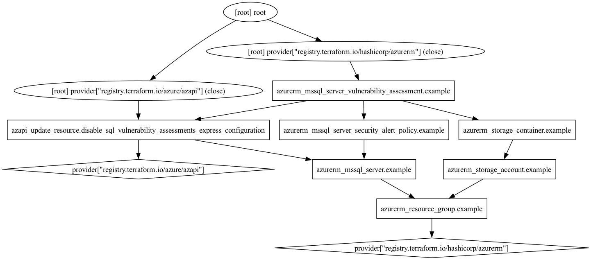

# blog-resources
Resources from blog

## Terraform

## mssql-vulnerability-assessments-classic-azapi
Shows how to enable classic MSSQL vulnerability assessments using Terraform's `azurerm` + `azapi`. Eventually this should all work in `azurerm`, but in the meantime this stopgap solution exists and is a great way to gain exposure to `azapi`

